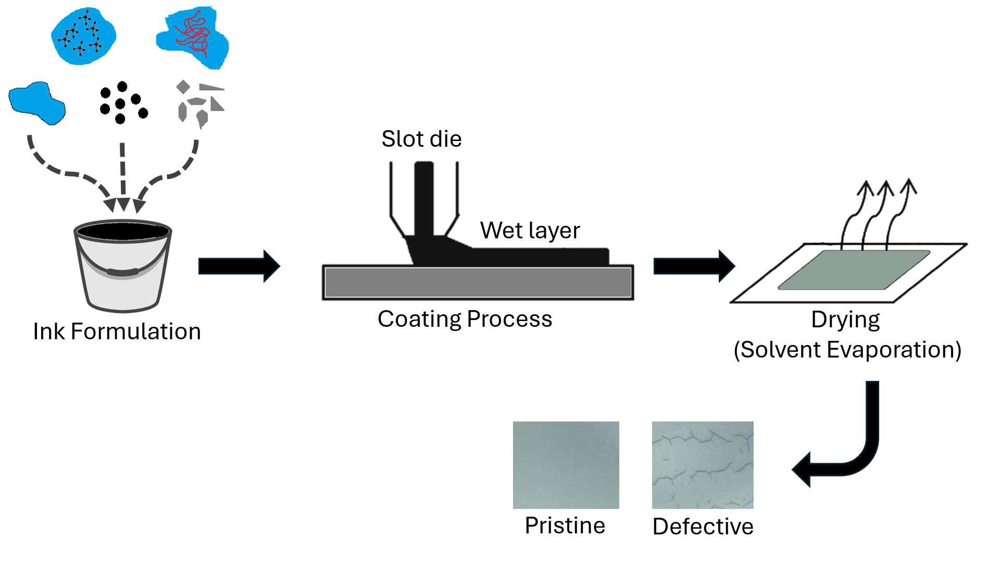
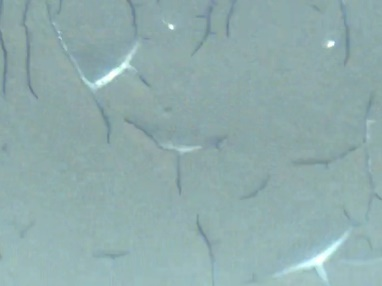
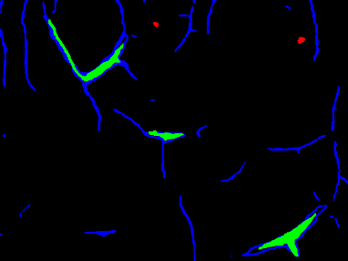
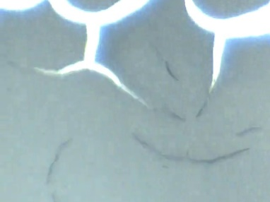
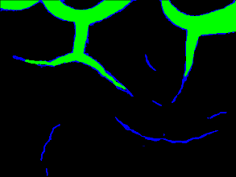
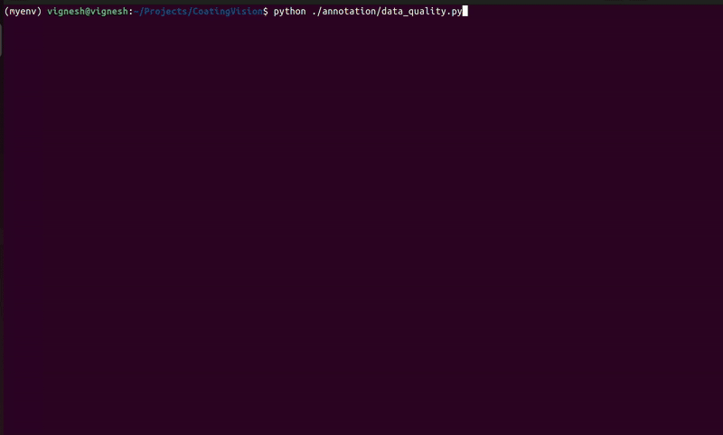

# 🔋CoatingVision  

The performance and reliability of both batteries and fuel cells are significantly influenced by the quality of the electrode coating process. Defects in electrode films, often arising during manufacturing, can degrade device performance and compromise safety in both energy storage and conversion systems. To support research on defect detection and the optimization of automated coating processes, we present **Coating Vision**, a comprehensive dataset of slot die-coated electrodes with labeled defect types.

This dataset encompasses a diverse range of image recognition tasks, including **defect segmentation, defect detection, and multi-label classification**. It includes high-resolution images with associated labels for common defects such as surface cracks, delamination cracks, pinholes, and unclassified  defects. The dataset has been meticulously curated to ensure high quality and consistency, providing researchers with reliable data for training and evaluating computer vision models. With over 2,200 image samples under various production conditions, Coating Vision offers a robust foundation for developing automated defect detection systems. It promotes deeper insights into manufacturing processes and accelerates advancements in both battery and fuel cell production technologies.

## 📌 Table of Contents  
- [Introduction](#-Introduction)
- [Literature Review](#-literature-review) 
- [Dataset](#dataset) 
- [Model Variants](#-Model-Variants) 
- [Features](#features)
- [Installation](#installation)  
- [Usage](#usage)
- [Results](#results)  
- [Future Work](#future-work)  
- [Contributing](#contributing)  
- [License](#license)  
- [Acknowledgments](#acknowledgments)

## 👋 **Introduction**

The dataset features labeled defects commonly found in electrode coatings, including **surface cracks** (fine fractures on the surface), **delamination** (separations within layers), **pinholes** (tiny voids or holes), and **unclassified defects**. These categories support diverse computer vision tasks such as segmentation, detection, and classification.

- **Electrode Coating Process Schematic:** A high-level schematic illustrating key stages of electrode fabrication, including slurry preparation, die slot coating, drying, and compaction.


- **Defect Segmentation Examples**: Sample electrode images paired with their segmentation masks, where surface cracks are shown in blue, delamination cracks in green, and pinholes in red.
<table>
  <tr>
    <td></td>
    <td></td>
  </tr>
  <tr>
    <td></td>
    <td></td>
  </tr>
</table>


## 📚 Literature Review
[literature-review](literature/literature_review.md)

## 📊 Dataset

1. Computer Vision-based feature extraction and thresholding utilities are available in the following script:

    ```bash
    ./annotation/annotation_utils.py


2. The pseudo/computer vision-based labels can be reviewed and manually corrected using the annotation quality control (QC) tools. Launch the QT-based application by running:
    
    ```bash
    python ./annotation/data_quality.py





## 🏗️ Model Variants

| Architecture | Type          | Names |
|-------------|--------------|-------------------------------------------------------------------------------------------------------------------------------------------------|
| UNet, FPN, LinkNet, PSPNet | ResNet       | `'resnet50' 'resnet101' 'resnet152'` |
| UNet, FPN, LinkNet, PSPNet | ConvNeXt      | `'convnextbase' 'convnextlarge' 'convnextsmall' 'convnexttiny' 'convnextxlarge'` |
| UNet, FPN, LinkNet, PSPNet | EfficientNet | `'efficientnetb0' 'efficientnetb1' 'efficientnetb2' 'efficientnetb3' 'efficientnetb4' 'efficientnetb5' 'efficientnetb6' 'efficientnetb7'` |
| UNet, FPN, LinkNet, PSPNet | EfficientNetV2 | `'efficientnetv2b0' 'efficientnetv2b1' 'efficientnetv2b2' 'efficientnetv2b3' 'efficientnetv2l' 'efficientnetv2m' 'efficientnetv2s'` |

> **Note:** All backbone weights are sourced from TensorFlow Keras Applications .

The `tf.keras.applications` module includes nearly all major model architectures commonly used in computer vision. Any of these architectures can be easily adapted within this framework by adding them to:


    ./src/backbones/keras_encoder.py


## 🛠️ Installation  
1. Create a virtual environment (optional but recommended):
    ```bash
   python3 -m venv env  
   source env/bin/activate  # On Windows use `env\Scripts\activate`
   
2. Clone the repository:  
   ```bash
   git clone https://github.com/vigsam-coder/CoatingVision.git
   cd CoatingVision
   pip install .

## 🚀 Usage
   
1. Download CoatingVision data
    ```bash
   python data.py
 
2. Change the model and augmentation configurations in
    ```bash
    ./configs/config.yaml
    ./configs/augmentation_config.yaml
   
3. Train the vision model
   ```bash
    python train.py --config ./configs/config.yaml --aug_config ./configs/augmentation_config.yaml

## 🔭 Future Work

We are continuously expanding our CoatingVision dataset by incorporating data collected using various camera modalities, such as line-scan cameras.


## 📖 Cite This Work

If you use this dataset or codebase in your research, please cite:

```bibtex
@article{Sampath2026,
  author       = {Sampath, Vignesh and Lee, Andrew S. and Miller, Samuel David and Paulson, Noah H. and Zhang, Yuepeng and Ward, Logan},
  title        = {A Defect Dataset for Electrode Coating Manufacturing},
  journal      = {Scientific Data},
  year         = {2026},
  month        = feb,
  day          = {14},
  issn         = {2052-4463},
  doi          = {10.1038/s41597-025-06419-1},
  url          = {https://doi.org/10.1038/s41597-025-06419-1}
}

