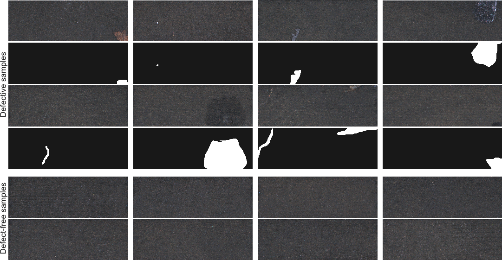
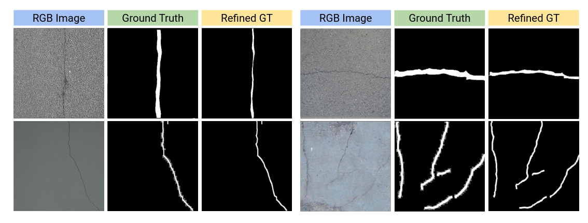
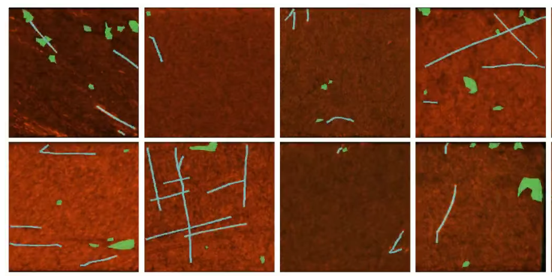
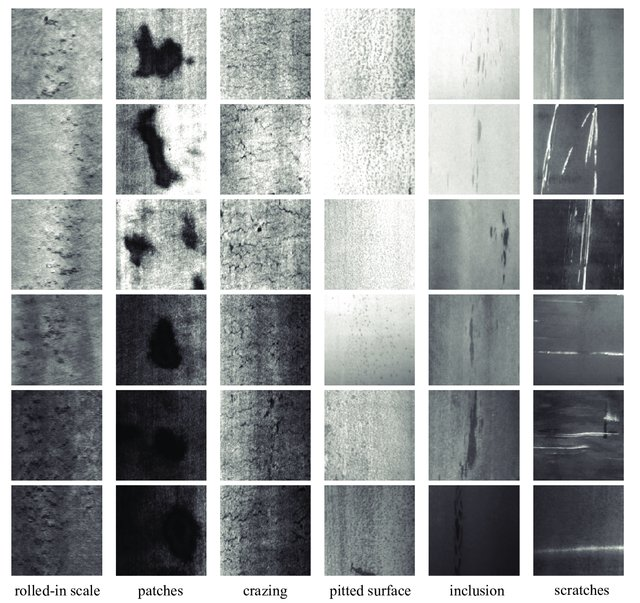
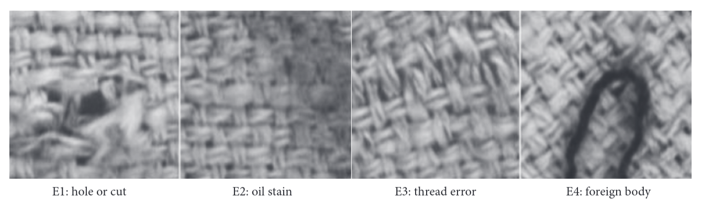
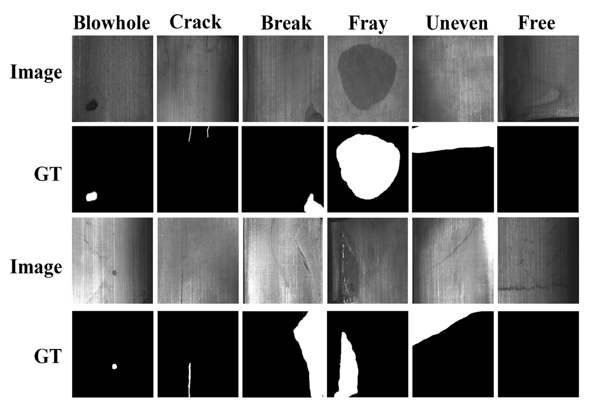
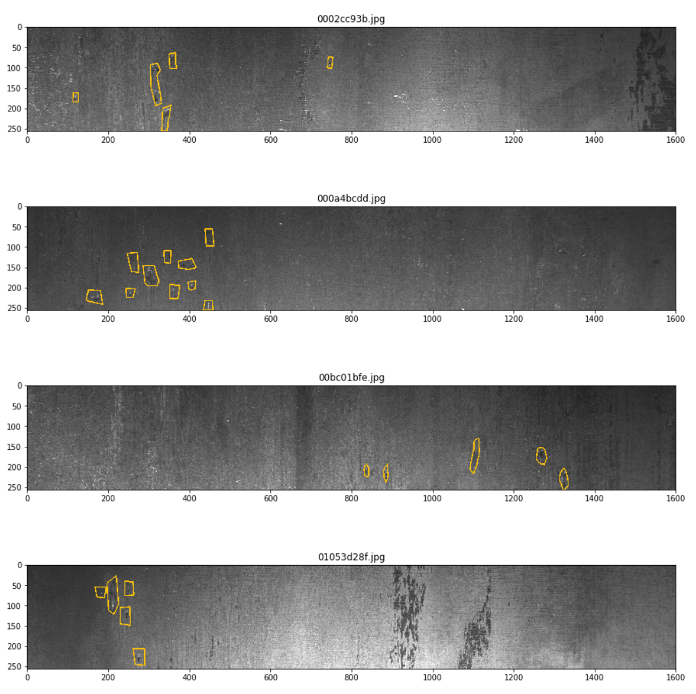
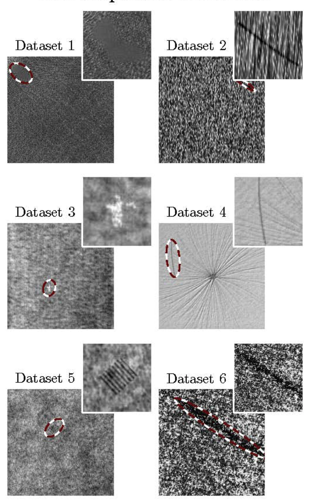
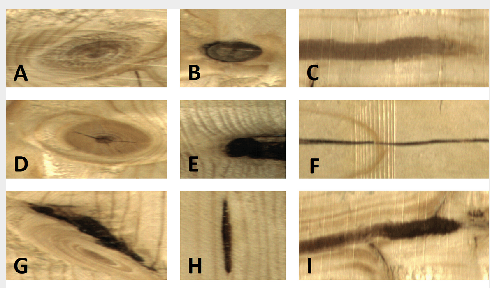
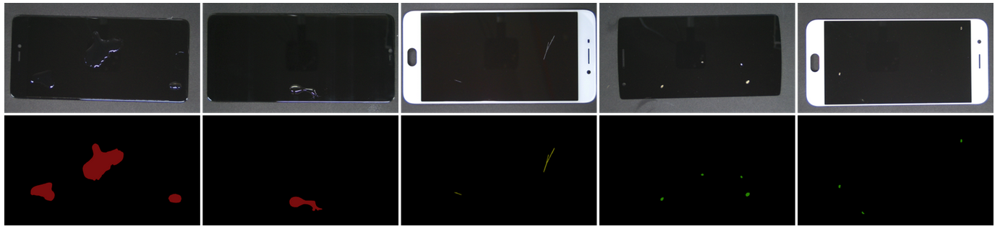

# Foundational-Model-for-Surface-defects

# Surface Defect Datasets

## Dataset Summary
| Dataset        | Number of Images |
|----------------|------------------|
| KolektorSDD2   | 3000             |
| CrackSeg9k     | 9000             |
| Heat Sink      | 1000             |
| NEU            | 1656             |
| Fabric         | 3200             |
| Magnetic       | 2688             |
| Severstal      | 6666             |
| Wood           | 4000             |
| GC10-Det       | 2306             |
| Coating        | 2000             |
| Mobile         | 1200             |
| Marble         | 2000             |

---

## Description and Links

### KolektorSDD2 (Kolektor Surface-Defect Dataset 2)
Images of defected production items.  

---

### CrackSeg9k
A collection and benchmark for crack segmentation datasets and frameworks.  

---

### Heat Sink
[Heat Sink Surface Defect Dataset](https://datasetninja.com/heat-sink-surface-defect-dataset#download)

---

### Steel
[NEU Metal Surface Defects Data](https://www.kaggle.com/datasets/fantacher/neu-metal-surface-defects-data)

---

### Fabrics
[TILDA Textile Dataset](https://lmb.informatik.uni-freiburg.de/resources/datasets/tilda.en.html)

---

### Magnetic Tile
[Magnetic Tile Surface Defects](https://www.kaggle.com/datasets/alex000kim/magnetic-tile-surface-defects)

---

### Steel Defect
[Severstal Steel Defect Detection](https://www.kaggle.com/competitions/severstal-steel-defect-detection)

---

### Various Statistically Textured Backgrounds
[Weakly Supervised Learning for Industrial Optical Inspection](https://hci.iwr.uni-heidelberg.de/content/weakly-supervised-learning-industrial-optical-inspection)

---

### Wood
[Large-Scale Image Dataset of Wood Surface Defects](https://www.kaggle.com/datasets/nomihsa965/large-scale-image-dataset-of-wood-surface-defects)

---

### Metal
[Defects Class and Location](https://www.kaggle.com/datasets/zhangyunsheng/defects-class-and-location)

---

### Mobile Phone
[FDSNeT: An Accurate Real-Time Surface Defect Segmentation Network](https://www.kaggle.com/datasets/girish17019/mobile-phone-defect-segmentation-dataset)

---

### Marble
[Marble Surface Anomaly Detection](https://www.kaggle.com/datasets/wardaddy24/marble-surface-anomaly-detection-2)
